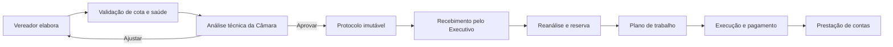

# Portal Legislativo e integração Câmara–Executivo

## Origem da decisão

Este módulo nasceu de uma entrevista em áudio recebida em 22 de julho de 2026
com um profissional da área. A transcrição abaixo foi limpa apenas para retirar
repetições e hesitações, sem mudar o sentido técnico:

> Eu acho que deveria ser criado um módulo legislativo. O processo começaria no
> vereador, na Câmara, com a indicação e o cadastro da emenda. Ele já informaria
> a entidade ou o beneficiário, se é custeio ou investimento e o valor.
>
> O sistema precisa verificar quanto cada vereador ainda tem disponível, com
> base no orçamento anual e na Receita Corrente Líquida, e também conferir o
> percentual destinado à saúde. Se o vereador tiver cem mil reais, por exemplo,
> metade precisa ir para a saúde.
>
> Fazendo isso antes, evitam-se erros que depois ficam travados entre o
> Legislativo e o Executivo e geram desgaste institucional. Depois que a emenda
> for encaminhada, o vereador deve conseguir acompanhar o andamento.
>
> O Executivo recebe a indicação, refaz a análise orçamentária e registra a
> reserva. Depois vêm a solicitação e a aprovação do plano de trabalho, o
> pagamento e a prestação de contas.

O áudio completo tem aproximadamente 3 minutos e 11 segundos. O trecho final
não acrescenta requisito ao produto.

## Decisão de produto

O TrilhaGov passa a controlar o ciclo antes de a emenda entrar no inventário do
Executivo. A Câmara prepara, analisa e protocola a proposta; a Prefeitura recebe,
reanalisa o orçamento, registra a reserva e segue pelo fluxo executivo já
existente.

## Primeira versão entregue

- perfis separados para vereador e análise legislativa;
- identidade parlamentar por Município, com nome, partido e mandato;
- proposta com objeto, justificativa, beneficiário, custeio ou investimento,
  valor, saúde, prioridade, necessidade pública e referências orçamentárias;
- cota global calculada sobre a RCL e dividida pelo número de cadeiras;
- carteira individual com utilizado, saldo e reserva mínima de saúde;
- análise prévia de PPA, LDO, LOA, plano setorial, limite, saúde, objeto,
  beneficiário e viabilidade;
- devolução para ajuste, aprovação ou rejeição fundamentada;
- protocolo Câmara–Executivo com fotografia JSON e SHA-256;
- recebimento idempotente que cria a emenda no inventário executivo;
- reanálise e reserva integral antes do Plano de Trabalho;
- histórico imutável, auditoria e notificações internas ou por e-mail;
- isolamento entre vereadores, municípios e ambientes Legislativo/Executivo.

## Regra normativa

Percentuais não são universais nem ficam fixos no código. Cada exercício usa uma
configuração municipal versionada, fundamentada na Lei Orgânica, no Regimento
Interno, no PPA, na LDO e na LOA.

Para municípios paulistas, o Manual TCESP de julho de 2026 recomenda atenção ao
limite global de 1,55% da RCL para Câmaras unicamerais, diante do entendimento
tratado no material. A metade reservada à saúde também deve seguir a norma local
e sua forma de apuração. O sistema alerta, calcula e preserva a configuração
usada, mas não substitui o parecer jurídico e contábil do Município.

Fontes primárias:

- [Manual de Emendas Orçamentárias Impositivas Municipais do TCESP](https://www.tce.sp.gov.br/publicacoes/manual-emendas-parlamentares-impositivas-municipais)
- [Comunicado SDG nº 28/2025](https://www.tce.sp.gov.br/legislacao/comunicado/emendas-parlamentares-impositivas-orcamento-municipal)
- [Resolução TCESP nº 17/2025](https://www.tce.sp.gov.br/sites/default/files/legislacao/RESOLU%C3%87%C3%83O-17-2025-EMENDAS%20PARLAMENTARES%20-%20vers%C3%A3o%20final.pdf)
- [Emenda Constitucional nº 86/2015](https://www.planalto.gov.br/ccivil_03/constituicao/emendas/emc/emc86.htm)

## Validação no Município piloto

- confirmar a fórmula da cota, a quantidade de vereadores e o exercício-base da RCL;
- confirmar se a reserva da saúde é apurada por vereador ou globalmente;
- validar o formulário e o checklist com assessoria legislativa e contabilidade;
- testar numeração, assinatura e comprovante do protocolo real da Câmara;
- comparar a reserva com o lançamento produzido pelo Siafic;
- definir quais informações o vereador pode acompanhar após o recebimento;
- validar modelos de devolução, impedimento e remanejamento entre os Poderes.

## Próxima integração

O próximo passo é importar e homologar a reserva e os eventos financeiros reais
do Siafic/Audesp. A proposta legislativa continua como origem; os dados oficiais
entram como confirmação ou divergência, nunca como sobrescrita silenciosa.
