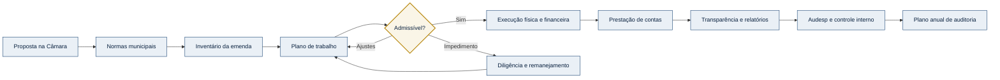
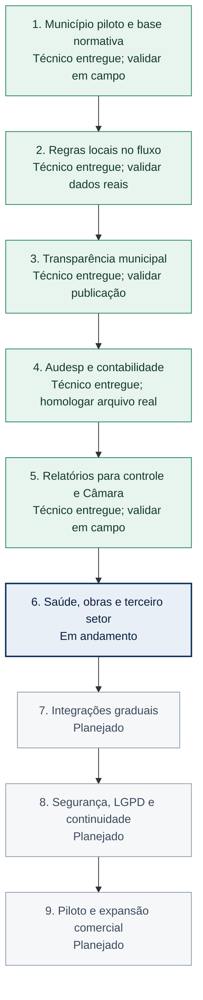

# Roadmap de módulos - TrilhaGov

Este documento organiza a evolução técnica e comercial. A ordem considera risco,
dependências e capacidade de validar cada entrega com usuários municipais.

## Mapa visual do produto

O fluxo abaixo representa o caminho operacional de uma emenda dentro do
TrilhaGov. Ele deve continuar simples para equipes municipais pequenas, mesmo
quando novos controles forem adicionados.

## Sequência atual de desenvolvimento

**Foco atual: validar a conciliação Siafic/Audesp com contador, fornecedor e arquivos reais do Município piloto.**

### Portal Legislativo e integração Câmara–Executivo

- [x] Perfis próprios para vereador e análise legislativa.
- [x] Proposta iniciada na Câmara com beneficiário, natureza, valor e saúde.
- [x] Cota global sobre a RCL dividida pelas cadeiras da Câmara.
- [x] Reserva de saúde apurada na carteira individual.
- [x] Análise técnica prévia antes do protocolo.
- [x] Fotografia e SHA-256 do encaminhamento ao Executivo.
- [x] Recebimento idempotente, criação da emenda e reserva orçamentária.
- [x] Acompanhamento legislativo integrado ao fluxo executivo.
- [x] Conciliação técnica da reserva, empenho, liquidação e pagamento por Código de Aplicação.
- [ ] Validar fórmula, formulário, protocolo e permissões com uma Câmara piloto.
- [ ] Conferir a reserva real com o Siafic municipal.

### Programa de Auditoria e Papéis de Trabalho

- [x] Programa executável vinculado ao item emitido do Plano Anual.
- [x] Estratégia, materialidade, população e amostra documentadas.
- [x] Procedimentos, testes e resultados por papel de trabalho.
- [x] Evidências privadas, imutáveis e identificadas por SHA-256.
- [x] Achados estruturados com critério, condição, causa, efeito e recomendação.
- [x] Segregação entre auditor líder e supervisor.
- [x] Devolução, aprovação e conclusão formal com fotografia SHA-256.
- [x] Encerramento integrado ao Plano Anual, alertas e Central de Trabalho.
- [ ] Validar os papéis de trabalho com um controlador municipal.

### Comunicações e Documentos Oficiais

- [x] Seis modelos iniciais: ofício de impedimento, notificação, diligência,
  despacho, parecer e termo de encaminhamento.
- [x] Modelos configuráveis e versionados por Município.
- [x] Geração assistida com dados da emenda, impedimento, diligência ou parecer.
- [x] Revisão de minuta antes da emissão.
- [x] Numeração sequencial por tipo e exercício.
- [x] Conteúdo emitido imutável com fotografia e SHA-256.
- [x] Protocolo, canal, comprovante privado e confirmação ou devolução.
- [x] Correções por nova versão, sem apagar o documento anterior.
- [x] Permissões e isolamento entre Municípios.
- [ ] Validar a redação e a numeração com Câmara, Procuradoria e Controle Interno
  de um Município piloto.

## Sequência de implantação municipal

### Entregas dos relatórios municipais

- [x] Relatório mensal de governança municipal.
- [x] Protocolo e histórico de remessas entre órgãos.
- [x] Parecer formal do controle interno com evidências.
- [x] Plano anual de auditoria orientado por risco.
- [x] Relatório consolidado de reserva e execução em saúde.
- [x] Relatório de divergências entre orçamento, financeiro e entrega física.
- [x] Dossiê anual para controle interno, Câmara e prestação de contas.
- [ ] Validar os três produtos e suas ressalvas com Contabilidade, Câmara e
  Controle Interno de um Município piloto.

### Saúde e LC 141

- [x] Central municipal das emendas destinadas à saúde.
- [x] Conferência separada entre reserva local e enquadramento em ASPS.
- [x] Matriz dos critérios dos arts. 2º e 3º e das vedações do art. 4º da LC 141.
- [x] Parecer favorável ou contrário, revisão por perfil autorizado e histórico
  imutável por versão.
- [x] PDF do parecer, alertas de risco e ações na Central de Trabalho.
- [x] Indicadores ASPS no relatório especializado de saúde.
- [ ] Validar categorias, fontes, códigos de aplicação e redação dos pareceres
  com Contabilidade, Fundo de Saúde e Controle Interno do Município piloto.
- [ ] Conciliar o percentual constitucional completo com SIOPS e RREO reais.

### Obras Públicas e Licitações

- [x] Central municipal de processos, obras e contratos vinculados às emendas.
- [x] Checklist da fase preparatória, forma de contratação e regime de execução.
- [x] Cadastro de gestor, fiscal, responsável técnico, ART/RRT, vigência e
  publicidade.
- [x] Bloqueios de transição entre planejamento, seleção, contrato, execução,
  paralisação e recebimento.
- [x] Medições com evidência, ateste, avanço físico e fotografia imutável.
- [x] Termos aditivos com justificativa, publicidade e controle acumulado dos
  limites do art. 125 da Lei 14.133.
- [x] Alertas, Central de Trabalho, divergência físico-financeira e dossiê PDF.
- [ ] Validar checklist, papéis, modelos de boletim e termos de recebimento com
  Engenharia, Licitações, Procuradoria e Controle Interno do Município piloto.
- [ ] Confrontar contratos e aditivos reais com PNCP, Siafic e sistema municipal.

Regra de atualização: ao concluir uma entrega, marcar o item neste arquivo e
mover o destaque `focus` da sequência de desenvolvimento somente quando os
critérios técnicos da entrega tiverem sido
verificados. O detalhamento completo das etapas permanece no
[roteiro de implantação municipal](roteiro-implantacao-municipal.md).

## Entregue - planejamento de emendas impositivas municipais

- Plano de trabalho estruturado conforme o Manual TCESP de julho de 2026.
- Cronograma físico-financeiro conciliado com o valor da emenda.
- Submissão versionada e bloqueio durante análise.
- Parecer de admissibilidade com aprovação, ajustes ou rejeição fundamentada.
- Histórico imutável, PDF e integração com a Central de Trabalho.

## Entregue - impedimentos, diligências e remanejamento

- Ocorrência técnica com categoria, natureza, impacto, responsável, prazo e evidência.
- Classificação temporária ou insuperável e encerramento fundamentado.
- Diligência com solicitação, resposta, protocolo, documento e avaliação da resposta.
- Proposta preservando o objeto original e decisão restrita ao gestor.
- Alertas de prazo, auditoria e ações automáticas na Central de Trabalho.

## Entregue - parametrização normativa municipal

- Configurações versionadas por município, exercício e revisão.
- Cadastro de Lei Orgânica, Regimento Interno, PPA, LDO, LOA e atos locais.
- Parâmetros de limite, RCL, saúde, admissibilidade, impedimentos e transparência.
- Situação Audesp, responsável, rastreabilidade bancária e retenção documental.
- Diagnóstico explicável com requisitos obrigatórios e pontos de atenção.
- Revisão jurídica obrigatória antes da ativação.
- Congelamento da versão vigente e cópia segura para novas revisões.
- Isolamento municipal, permissões, idempotência e auditoria.

Próxima validação: preencher a configuração de um exercício com a procuradoria,
controladoria, contabilidade e Câmara de um município piloto.

## Entregue - aplicação operacional das normas municipais

- Vínculo histórico da emenda e do impedimento à revisão normativa utilizada.
- Aplicação automática no cadastro manual, planilha e inventário preexistente.
- Validação de valor mínimo, quantidade e teto financeiro por autor.
- Mensagens de campo com valor encontrado, limite e versão de fundamento.
- Detecção posterior para dados importados ou legados fora dos parâmetros.
- Prazos distintos para comunicar e sanear impedimentos.
- Protocolo obrigatório para concluir a comunicação formal.
- Alertas e ações de trabalho resolvidos automaticamente após a correção.
- Consolidação provisória da reserva da saúde global ou por vereador.

Próxima validação: conferir a apuração agregada da saúde com a contabilidade e o
controle interno de um município piloto.

## Entregue - transparência municipal conforme Resolução TCESP nº 17/2025

- Rol mínimo do artigo 3º no cadastro, detalhe público e CSV aberto.
- Valores autorizado, liberado e executado apresentados separadamente.
- Conta específica ou exceção da execução direta com Fonte de Recursos e Códigos
  de Aplicação Fixo e Variável.
- Instrumento jurídico, processo administrativo, localidade, destinação e prazo de
  aplicação.
- Cronograma físico-financeiro derivado do plano de trabalho municipal.
- Histórico público imutável de alterações, acréscimos, reduções, cancelamentos,
  pagamentos e mudanças de cronograma.
- Diagnóstico interno, alerta e ação de trabalho com limite no dia útil seguinte.
- Importação municipal bloqueada quando os dados mínimos estiverem incompletos.
- Proteção de notas internas, usuários, fornecedores e documentos privados.

Próxima validação: controle interno e procuradoria do Município piloto devem conferir
os campos publicados e a aplicação da exceção bancária em um caso real anonimizado.

## Módulo 0 - Identidade municipal

Situação: base concluída nesta etapa.

Necessidades:

- usuário autenticado;
- município obrigatório com nome, UF, CNPJ válido e código IBGE;
- seleção do município ativo;
- isolamento entre municípios;
- proteção de formulários contra reenvio;
- sessão e CSRF;
- reset individual de estado temporário e prevenção de telas autenticadas em cache;
- futura recuperação de senha;
- convite seguro de servidores concluído no módulo de usuários.

Critério de conclusão: nenhuma área interna pode ser aberta sem usuário,
município completo e contexto municipal ativo.

## Módulo 1 - Inventário de emendas

Situação: primeira versão concluída.

Necessidades:

- identificação, esfera, exercício, autoria e modalidade;
- objeto e secretaria responsável;
- valores previsto e recebido;
- situação do ciclo;
- prazos e conclusão dos marcos;
- busca e filtros;
- painel consolidado.

Próxima validação: cadastrar uma emenda real anonimizada com um gestor e revisar
todos os termos usados no formulário.

## Módulo 2 - Usuários, perfis e trilha de auditoria

Situação: primeira versão concluída.

O gestor convida usuários por e-mail ou link temporário, altera perfis e revoga
convites pendentes. O aceite funciona para contas novas e existentes, sempre
limitado ao município do convite. Criação e alteração de emendas e mudanças de
perfil geram histórico imutável.

Necessidades:

- convite de usuários pelo gestor;
- perfis `gestor`, `editor`, `consulta` e `auditoria`;
- registro de criação e alteração de dados;
- valor anterior e novo valor nos campos críticos;
- data, usuário, município e origem da ação;
- histórico imutável pela interface comum.

Dependência: identidade municipal concluída.

Motivo: documentos e execução financeira não devem entrar sem ser possível
identificar quem alterou cada informação.

## Módulo 3 - Documentos e checklists

Situação: primeira versão concluída.

O gestor configura tipos ativos e obrigatórios para o município. Gestores e
editores podem anexar arquivos privados e versionados; consulta e auditoria podem
baixá-los após autorização municipal. Uploads e alterações do checklist geram
registros de auditoria.

Necessidades:

- arquivos privados por emenda;
- tipos de documento configuráveis;
- plano de trabalho, extratos, contratos, notas e relatórios;
- checklist por modalidade;
- versão e data do documento;
- download autorizado;
- registro na trilha de auditoria;
- política de tamanho, formato, retenção e backup.

Dependências: perfis e auditoria.

Próxima validação: comparar os tipos sugeridos com checklists reais de pelo menos
dois municípios e confirmar política de retenção, tamanho e formatos permitidos.

Validação necessária: obter checklists reais de pelo menos dois municípios ou
órgãos de controle antes de automatizar documentos obrigatórios.

## Módulo 4 - Execução física e financeira

Situação: primeira versão concluída.

Necessidades:

- conta bancária específica;
- metas, etapas e entregas;
- empenhos, pagamentos e saldo;
- fornecedor e processo de contratação;
- vínculo de cada gasto ao objeto;
- percentual executado;
- evidências da entrega;
- conciliação com valores recebidos.

Dependências: documentos, permissões e auditoria.

Alerta: não construir contabilidade paralela. O módulo deve consolidar controle
e evidências, com futura integração ao Siafic quando houver viabilidade.

## Módulo 5 - Prestação de contas e transparência

Situação: primeira versão da prestação de contas, inteligência gerencial,
transparência pública e exportação em planilha concluída.

Necessidades:

- relatório consolidado por exercício, modalidade e situação;
- origem, objeto, valores e estágio de execução;
- exportação em PDF e planilha;
- página pública com campos aprovados;
- conferência de dados ausentes;
- histórico do relatório gerado.

Entregue na primeira versão:

- processo com responsável, prazo, situação, protocolo e aprovação;
- checklist operacional configurável e documentos vinculados;
- conciliação entre recebido, pago, devolvido e saldo pendente;
- diligências com responsável, prazo, resposta e protocolo;
- indicador de prontidão e bloqueio de envio com pendências;
- dossiê consolidado em PDF e pacote ZIP com documentos privados;
- alertas, escalonamento e auditoria das operações.
- painel analítico filtrável com funil financeiro, execução física e qualidade cadastral;
- diagnósticos automáticos de prazo, risco, responsabilidade e concentração de recursos;
- exportação CSV interna auditada e protegida contra fórmulas;
- portal público opcional, ativado pelo gestor, com filtros e exportação de dados;
- bloqueio de dados internos, documentos, fornecedores, usuários e motivos de risco na visão pública.

Dependências: execução, documentos e auditoria.

Validação necessária: confirmar o formato exigido pelo tribunal de contas e pelo
Portal da Transparência do estado atendido.

Próxima evolução: versionar relatórios oficiais e integrar fontes do Transferegov
sem sobrescrever informações municipais confirmadas.

## Módulo 6 - Alertas e responsabilidades

Situação: primeira versão concluída.

Cada emenda possui responsável operacional validado contra a equipe municipal.
Prazos, documentos e inconsistências alimentam notificações idempotentes, dois
níveis configuráveis de escalonamento e uma matriz de risco explicável.

Necessidades:

- responsável por etapa;
- responsável operacional por emenda;
- alertas internos e por e-mail;
- antecedência configurável;
- escalonamento de prazo vencido;
- confirmação de leitura;
- registro do alerta na auditoria.
- nota de risco com os motivos detectados.

Dependências: usuários, prazos confiáveis e auditoria.

Não incluir WhatsApp automático antes de validar consentimento, custo e canal
institucional de cada prefeitura.

## Módulo 7 - Integrações oficiais

Situação: primeira versão da integração com Transferências Especiais do
Transferegov concluída.

Necessidades candidatas:

- dados abertos e APIs do Transferegov;
- importação de emendas e atualizações;
- identificação da fonte e horário da sincronização;
- tratamento de divergências sem sobrescrever dado confirmado;
- monitoramento de falhas e mudança de contrato da API.

Entregue na primeira versão:

- consulta do beneficiário pelo CNPJ municipal na API pública oficial;
- leitura paginada dos planos de ação e da data de atualização da fonte;
- histórico de sincronizações, quantidades, falhas e usuário iniciador;
- candidatos externos versionados por hash e separados por município;
- correspondência por código do plano ou da emenda;
- detecção explicável de divergências em exercício, autoria, objeto e valor;
- vínculo sem sobrescrita, aplicação seletiva de campos e auditoria;
- importação somente após preenchimento das responsabilidades e datas municipais;
- descarte com justificativa e reabertura quando a fonte oficial mudar;
- retentativas limitadas e mensagem humana quando a API estiver indisponível.

Evolução entregue: conciliação histórica de empenhos federais, ordens bancárias e
saldo oficial, sem tratar a execução municipal como contabilidade equivalente.

Dependências: modelo estabilizado e dados reais suficientes para mapear os campos.

## Módulo 8 - Central de Trabalho Municipal

Situação: primeira versão concluída.

Entregue na primeira versão:

- fila operacional única para equipes municipais pequenas;
- geração idempotente a partir de responsabilidades, prazos, documentos,
  execução, conciliação e prestação de contas;
- prioridade explicável por vencimento e sensibilidade operacional;
- atribuição, andamento e anotações sem permitir conclusão fictícia;
- resolução automática quando o dado de origem é corrigido;
- reabertura sem duplicidade quando uma pendência retorna;
- atalhos para o contexto exato e atualização horária agendada;
- isolamento municipal, perfis e auditoria.

Próxima validação: observar uma equipe municipal usando a fila durante uma semana
e medir quais ações são úteis, redundantes ou ainda precisam de orientação.

## Módulo 9 - Importação Assistida de Planilhas

Situação: primeira versão concluída.

Entregue na primeira versão:

- modelo CSV compatível com Excel e outros editores de planilhas;
- leitura de vírgula ou ponto e vírgula e codificações comuns do Windows;
- normalização de datas, valores e termos municipais em português;
- pré-visualização por linha antes de alterar o inventário;
- classificação explicável entre apta, duplicada e inválida;
- importação apenas das linhas aptas, sem sobrescrever registros;
- nova verificação de concorrência durante a confirmação;
- limite por arquivo, isolamento municipal, perfis, idempotência e auditoria;
- atualização dos alertas e da Central de Trabalho após a importação.

Próxima validação: testar arquivos reais anonimizados de pelo menos dois
municípios antes de adicionar `.xlsx` ou mapeamento manual de colunas.

## Ordem recomendada

A sequência visual no início deste documento é a referência atual:

1. validar em campo Programa de Auditoria, Comunicações, Relatórios e Saúde;
2. manter a primeira versão de Comunicações e Documentos Oficiais;
3. manter os Relatórios Municipais Especializados;
4. manter e homologar Saúde e LC 141 com dados reais;
5. manter e homologar Obras Públicas e Licitações com processos reais;
6. homologar integrações reais com Siafic, Audesp e Câmara;
7. concluir LGPD, continuidade e administração comercial do SaaS.

As validações de campo podem ocorrer em paralelo ao desenvolvimento, mas uma
etapa não deve ser tratada como comercialmente concluída apenas porque sua
implementação técnica foi entregue.

## Itens fora do escopo atual

- inteligência artificial para decidir conformidade;
- promessa automática de ausência de multa;
- substituição do Transferegov ou Siafic;
- aplicativo mobile nativo;
- microsserviços;
- blockchain;
- automação de regras sem fonte normativa versionada.
